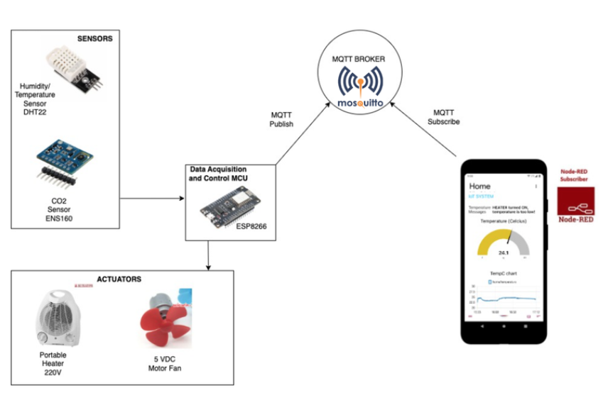

ESP32 Mushroom Cultivation Monitoring System

This repository contains the main ESP32 code for a mushroom cultivation monitoring system developed for the IoT Workshop course.

Project Overview

The system uses an ESP32 to monitor environmental parameters in a mushroom cultivation setup, such as temperature, humidity, and CO₂ levels. Sensor data is sent over MQTT and displayed on a local dashboard built with Node-RED for real-time monitoring.

Features

Collects sensor data for environmental conditions.

Publishes data to an MQTT broker.

Data visualization and monitoring via a local Node-RED dashboard.

Hardware

ESP32 development board

DHT21 (temperature & humidity)

CO₂ sensor

Optional actuators for environmental control

Usage

Upload the code to the ESP32.

Configure the MQTT broker credentials in the code.

Launch the Node-RED dashboard locally to visualize real-time data.

## Architecture

  

**Figure:** System architecture — ESP32 reads DHT21 and ENS160 sensors, publishes to MQTT (e.g. Node-RED dashboard), and drives actuators (fan/heater) as needed.

See the main firmware: [`main-esp32.ino`](main-esp32.ino)

## Project Images

Below are project images (click to open full-size):

- Architecture: [assets/images/architecture.png](assets/images/architecture.png)  
  

- Hardware (example): [assets/images/hardware.jpg](assets/images/hardware.jpg)  
  
